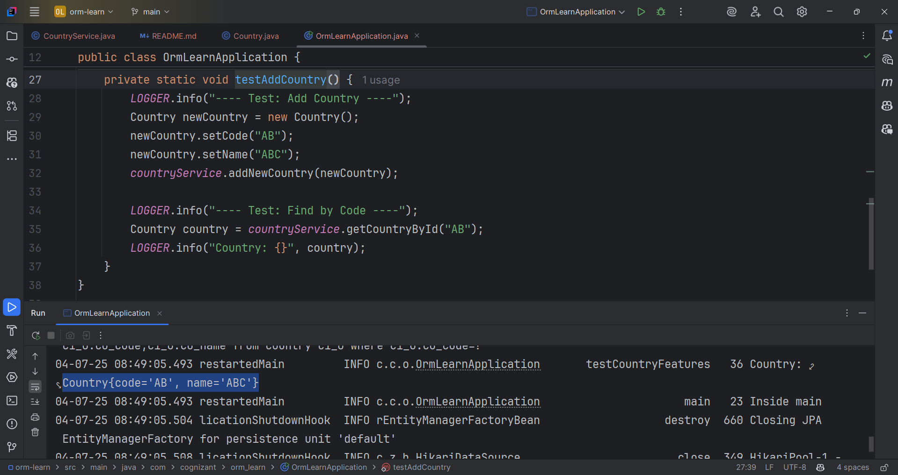

Hands on 7

Add a new country

•	Create new method in CountryService.

    @Transactional
    public void addCountry(Country country)

•	Invoke save() method of repository to get the country added.

    countryRepository.save(country)

•	Include new testAddCountry() method in OrmLearnApplication. Perform steps below:

o	Create new instance of country with a new code and name

o	Call countryService.addCountry() passing the country created in the previous step.

o	Invoke countryService.findCountryByCode() passing the same code used when adding a new country

o	Check in the database if the country is added
