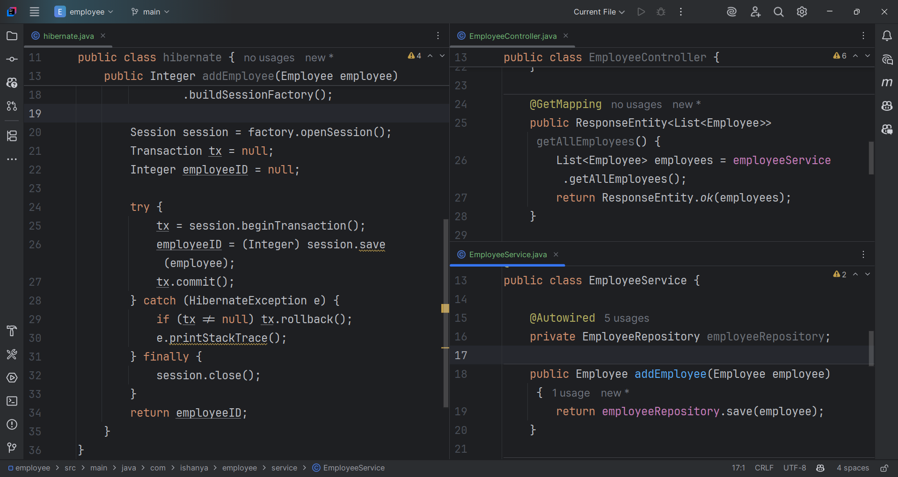

Hands on 4

Difference between JPA, Hibernate and Spring Data JPA

Java Persistence API (JPA)

•	JSR 338 Specification for persisting, reading and managing data from Java objects

•	Does not contain concrete implementation of the specification

•	Hibernate is one of the implementation of JPA

Hibernate

•	ORM Tool that implements JPA
Spring Data JPA

•	Does not have JPA implementation, but reduces boiler plate code

•	This is another level of abstraction over JPA implementation provider like Hibernate

•	Manages transactions

Refer code snippets below on how the code compares between Hibernate and Spring Data JPA
Hibernate

/* Method to CREATE an employee in the database */
public Integer addEmployee(Employee employee){
Session session = factory.openSession();
Transaction tx = null;
Integer employeeID = null;

      try {
         tx = session.beginTransaction();
         employeeID = (Integer) session.save(employee); 
         tx.commit();
      } catch (HibernateException e) {
         if (tx != null) tx.rollback();
         e.printStackTrace(); 
      } finally {
         session.close(); 
      }
      return employeeID;
    }

Spring Data JPA

EmployeeRespository.java

    public interface EmployeeRepository extends JpaRepository<Employee, Integer> {
    
    }

EmployeeService.java

    @Autowire
    private EmployeeRepository employeeRepository;

    @Transactional
    public void addEmployee(Employee employee) {
        employeeRepository.save(employee);
    }
