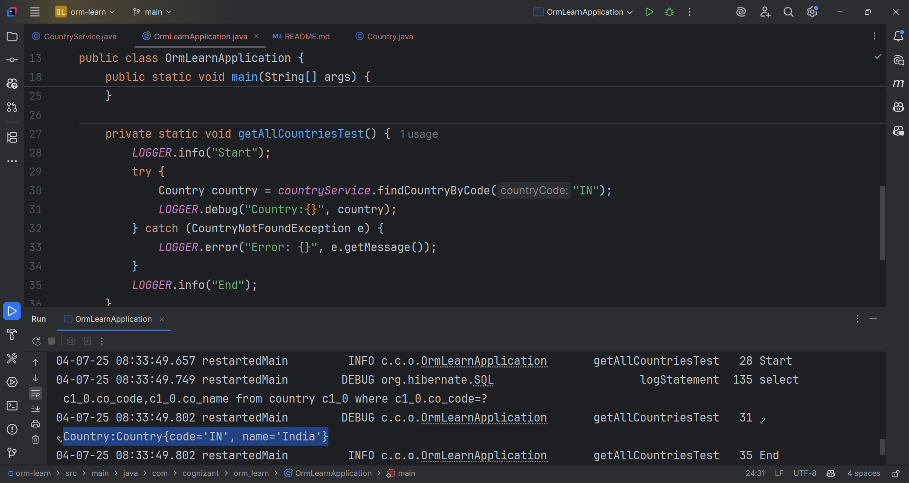

Find a country based on country code

•	Create new exception class CountryNotFoundException in com.cognizant.spring-learn.service.exception

•	Create new method findCountryByCode() in CountryService with @Transactional annotation

•	In findCountryByCode() method, perform the following steps:

o	Method signature

    @Transactional
    public Country findCountryByCode(String countryCode) throws CountryNotFoundException

•	Get the country based on findById() built in method

    Optional<Country> result = countryRepository.findById(countryCode);

•	From the result, check if a country is found. If not found, 

    throw CountryNotFoundException
    if (!result.isPresent())

•	Use get() method to return the country fetched.

    Country country = result.get();

•	Include new test method in OrmLearnApplication to find a country based on country code and compare the country name to check if it is valid.

    private static void getAllCountriesTest() {
    LOGGER.info("Start");
    Country country = countryService.findCountryByCode("IN");
    LOGGER.debug("Country:{}", country);
    LOGGER.info("End");
    }

•	Invoke the above method in main() method and test it.

NOTE: SME to explain the importance of @Transactional annotation. Spring takes care of creating the Hibernate session and manages the transactionality when executing the service method.
