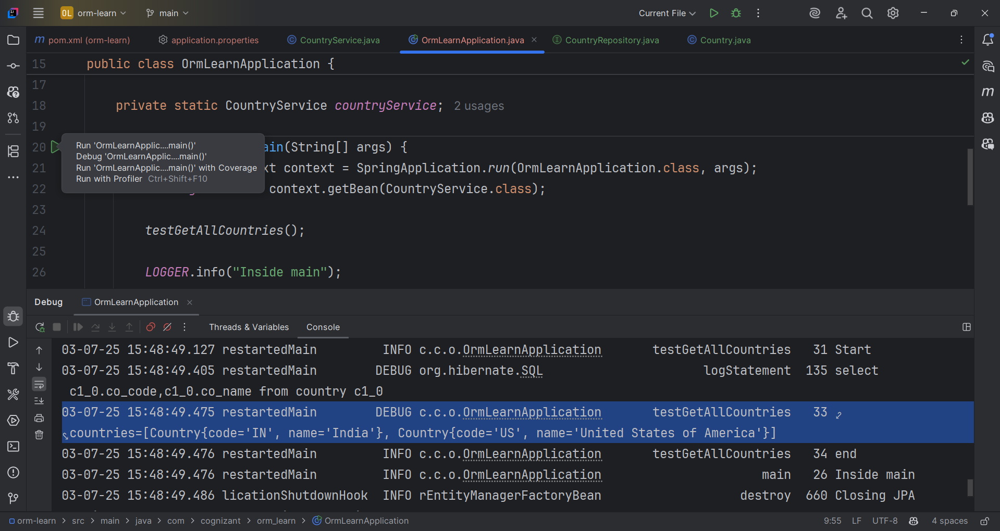

Hands on 1

Spring Data JPA - Quick Example

Software Pre-requisites

•	MySQL Server 8.0

•	MySQL Workbench 8

•	Eclipse IDE for Enterprise Java Developers 2019-03 R

•	Maven 3.6.2

• Create a Eclipse Project using Spring Initializr

•	Go to https://start.spring.io/

•	Change Group as “com.cognizant”

•	Change Artifact Id as “orm-learn”

•	In Options > Description enter "Demo project for Spring Data JPA and Hibernate"

•	Click on menu and select "Spring Boot DevTools", "Spring Data JPA" and "MySQL Driver"

•	Click Generate and download the project as zip

•	Extract the zip in root folder to Eclipse Workspace

•	Import the project in Eclipse "File > Import > Maven > Existing Maven Projects > Click Browse and select extracted folder > Finish"

•	Create a new schema "ormlearn" in MySQL database. Execute the following commands to open MySQL client and create schema.

> mysql -u root -p

mysql> create schema ormlearn;

•	In orm-learn Eclipse project, open src/main/resources/application.properties and include the below database and log configuration.

# Spring Framework and application log

    logging.level.org.springframework=info
    logging.level.com.cognizant=debug

# Hibernate logs for displaying executed SQL, input and output
    logging.level.org.hibernate.SQL=trace
    logging.level.org.hibernate.type.descriptor.sql=trace

# Log pattern
    logging.pattern.console=%d{dd-MM-yy} %d{HH:mm:ss.SSS} %-20.20thread %5p %-25.25logger{25} %25M %4L %m%n

# Database configuration
    spring.datasource.driver-class-name=com.mysql.cj.jdbc.Driver
    spring.datasource.url=jdbc:mysql://localhost:3306/ormlearn
    spring.datasource.username=root
    spring.datasource.password=root

# Hibernate configuration
    spring.jpa.hibernate.ddl-auto=validate
    spring.jpa.properties.hibernate.dialect=org.hibernate.dialect.MySQL5Dialect
    •	Build the project using ‘mvn clean package -Dhttp.proxyHost=proxy.cognizant.com -Dhttp.proxyPort=6050 -Dhttps.proxyHost=proxy.cognizant.com -Dhttps.proxyPort=6050 -Dhttp.proxyUser=123456’ command in command line
•	Include logs for verifying if main() method is called.

    import org.slf4j.Logger;
    import org.slf4j.LoggerFactory;

    private static final Logger LOGGER = LoggerFactory.getLogger(OrmLearnApplication.class);
    
    public static void main(String[] args) {
    SpringApplication.run(OrmLearnApplication.class, args);
    LOGGER.info("Inside main");
    }

•	Execute the OrmLearnApplication and check in log if main method is called.

SME to walk through the following aspects related to the project created:
1.	src/main/java - Folder with application code
2.	src/main/resources - Folder for application configuration
3.	src/test/java - Folder with code for testing the application
4.	OrmLearnApplication.java - Walkthrough the main() method.
5.	Purpose of @SpringBootApplication annotation
6.	pom.xml
1.	Walkthrough all the configuration defined in XML file
2.	Open 'Dependency Hierarchy' and show the dependency tree.

Country table creation
      •	Create a new table country with columns for code and name. For sample, let us insert one country with values 'IN' and 'India' in this table.
      create table country(co_code varchar(2) primary key, co_name varchar(50));
      •	Insert couple of records into the table
      insert into country values ('IN', 'India');
      insert into country values ('US', 'United States of America');

Persistence Class - com.cognizant.orm-learn.model.Country
•	Open Eclipse with orm-learn project
•	Create new package com.cognizant.orm-learn.model
•	Create Country.java, then generate getters, setters and toString() methods.
•	Include @Entity and @Table at class level
•	Include @Column annotations in each getter method specifying the column name.
    import javax.persistence.Column;
    import javax.persistence.Entity;
    import javax.persistence.Id;
    import javax.persistence.Table;
    
    @Entity
    @Table(name="country")
    public class Country {
    
        @Id
        @Column(name="code")
        private String code;
        
        @Column(name="name")
        private String name;
        
        // getters and setters
        
        // toString()
        
    }

Notes:
•	@Entity is an indicator to Spring Data JPA that it is an entity class for the application

•	@Table helps in defining the mapping database table

•	@Id helps is defining the primary key

•	@Column helps in defining the mapping table column
Repository Class - com.cognizant.orm-learn.CountryRepository

•	Create new package com.cognizant.orm-learn.repository

•	Create new interface named CountryRepository that extends JpaRepository<Country, String>

•	Define @Repository annotation at class level

    import org.springframework.data.jpa.repository.JpaRepository;
    import org.springframework.stereotype.Repository;

    import com.cognizant.ormlearn.model.Country;

    @Repository
    public interface CountryRepository extends JpaRepository<Country, String> {
    
    }

Service Class - com.cognizant.orm-learn.service.CountryService

•	Create new package com.cognizant.orm-learn.service

•	Create new class CountryService

•	Include @Service annotation at class level

•	Autowire CountryRepository in CountryService

•	Include new method getAllCountries() method that returns a list of countries.

•	Include @Transactional annotation for this method

•	In getAllCountries() method invoke countryRepository.findAll() method and return the result

Testing in OrmLearnApplication.java

•	Include a static reference to 

CountryService in OrmLearnApplication class
    private static CountryService countryService;

•	Define a test method to get all countries from service.

    private static void testGetAllCountries() {
    LOGGER.info("Start");
    List<Country> countries = countryService.getAllCountries();
    LOGGER.debug("countries={}", countries);
    LOGGER.info("End");
    }
•	Modify SpringApplication.run() invocation to set the application context and the CountryService reference from the application context.
    ApplicationContext context = SpringApplication.run(OrmLearnApplication.class, args);
    countryService = context.getBean(CountryService.class);

        testGetAllCountries();

•	Execute main method to check if data from ormlearn database is retrieved.
