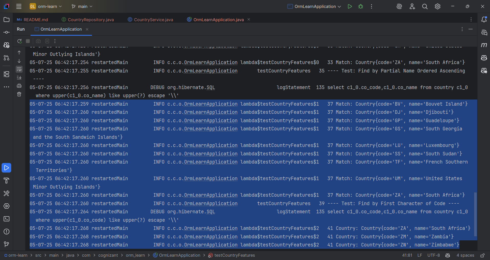

Hands on 1

Write queries on country table using Query Methods

Following are the list of queries that is required for an application. Implement these queries using Query Methods feature of Spring Data JPA. Click here for reference. Include appropriate methods in OrmLearnApplication and test the same.

•	An application has a search text box for searching by country. When typing characters on the text box, a list of all the matching countries should be displayed. For example, if 'ou' is entered in the search box the following countries should be displayed. Write a Query Method to achieve this feature. Implement this method in CountryRepository.
    
    BV       Bouvet Island                                
    DJ       Djibouti                                     
    GP       Guadeloupe                                   
    GS       South Georgia and the South Sandwich Islands
    LU       Luxembourg                                   
    SS       South Sudan                                  
    TF       French Southern Territories                  
    UM       United States Minor Outlying Islands         
    ZA       South Africa                                 
    •	Enhance the above method to return the countries in ascending order. Modify the query method name defined in the previous problem to achieve this.
    BV       Bouvet Island                                
    DJ       Djibouti                                     
    TF       French Southern Territories                  
    GP       Guadeloupe                                   
    LU       Luxembourg                                   
    ZA       South Africa                                 
    GS       South Georgia and the South Sandwich Islands
    SS       South Sudan                                  
    UM       United States Minor Outlying Islands       

•	To select a country an alphabet index is displayed in a web page, when the user clicks on the alphabet, all the countries starting that alphabet needs to be displayed. For example if the alphabet choose is 'Z', then the following countries should be displayed. Write a query method to get this feature incorporated.

    ZM       Zambia   
    ZW       Zimbabwe 
